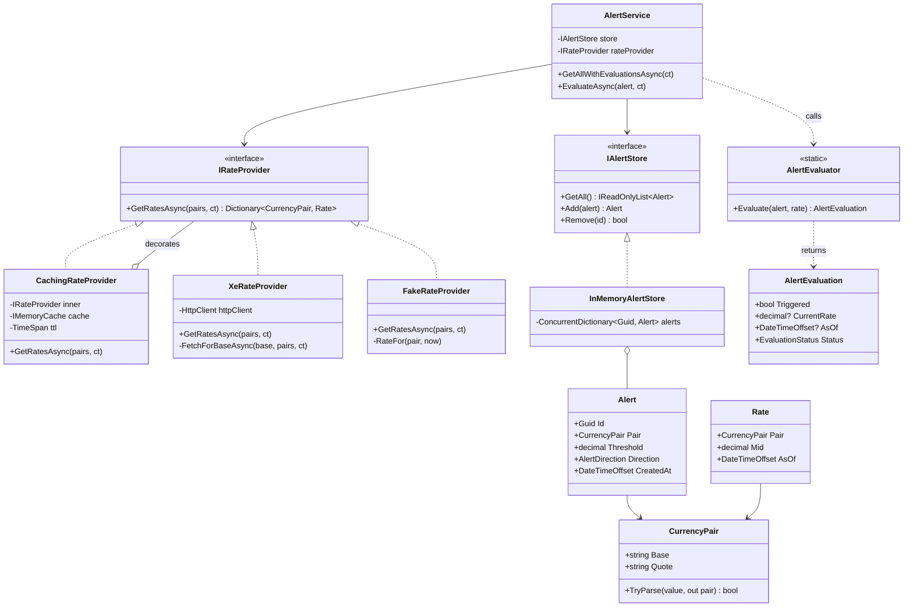
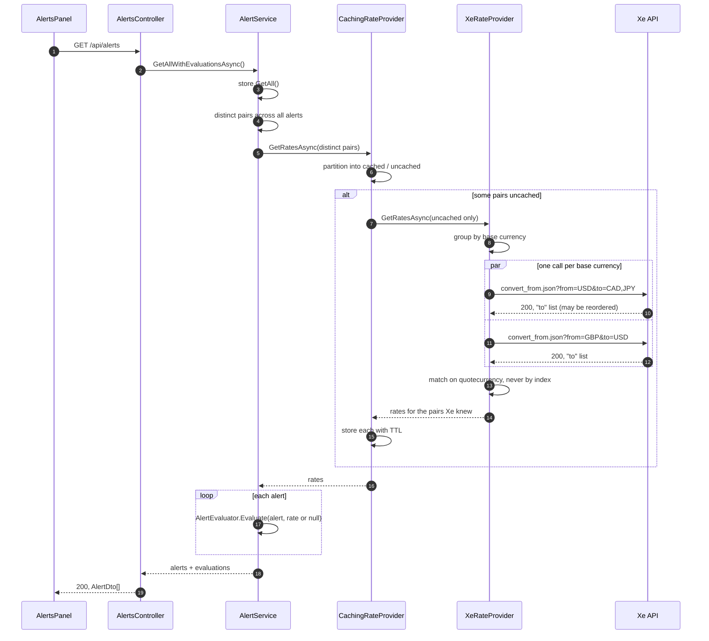
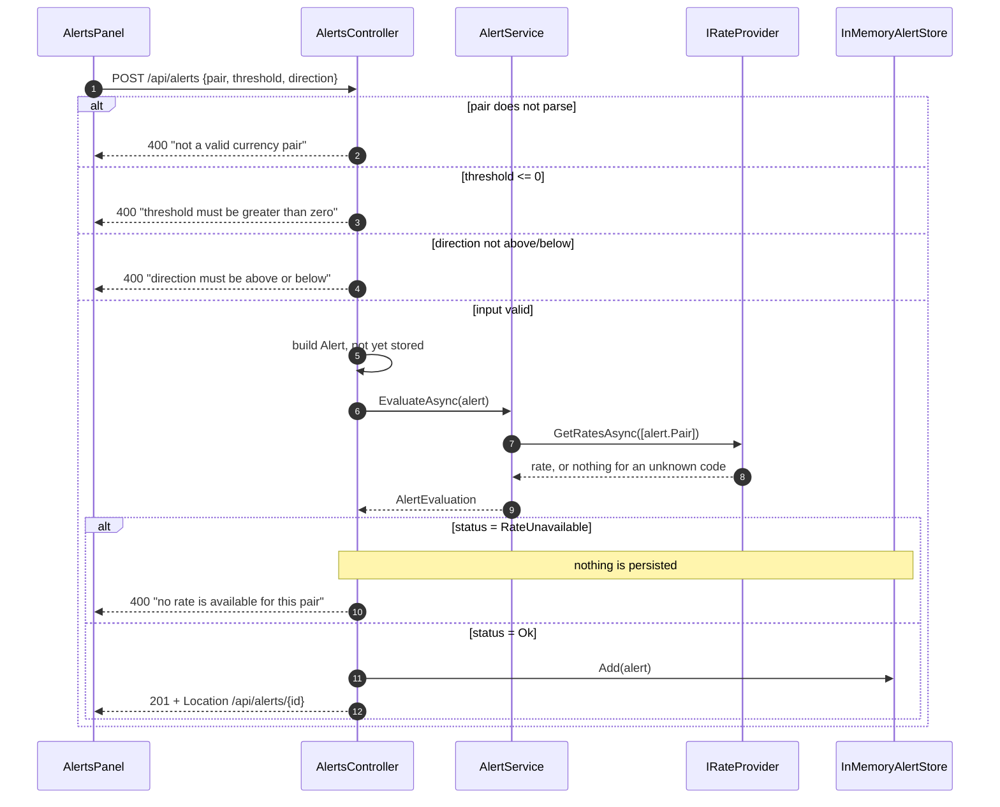
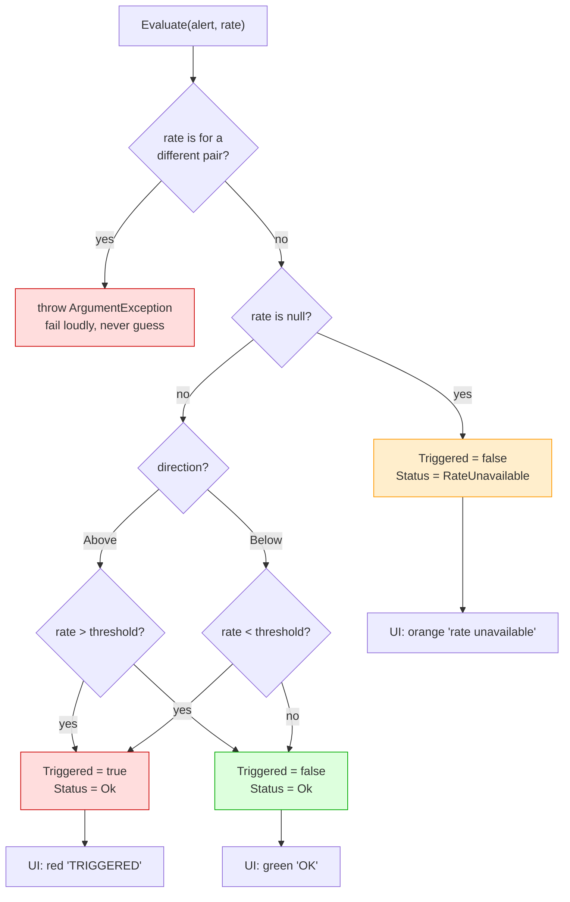

# NOTES — Diagrams

Companion to [`NOTES.md`](NOTES.md). These four diagrams cover the parts of the design that are
hard to see from any single file: how the rate providers compose, what a request actually costs
upstream, and where an alert's triggered state comes from.

---

## 1. Structure — services and models

The rate source is a decorator chain behind one interface. Nothing above `IRateProvider` knows
whether a rate came from Xe, from the cache, or from the development fake.

**Why the chain rather than one class:** the Xe sandbox key returns a constant `1.2345` for every
pair, which makes alert evaluation undemonstrable. `FakeRateProvider` substitutes for the *whole*
upstream in Development only. `CachingRateProvider` sits above whichever one is active, so the rate
board and every alert evaluation share one short-lived cache instead of each paying its own
round-trip.

---

## 2. Listing alerts — one batched call, not one per alert

`GET /api/alerts` is the request that would degrade worst under a naive implementation: N alerts
would mean N upstream calls. Distinct pairs are collected first, the cache absorbs repeats, and only
genuine misses reach Xe — grouped so that pairs sharing a base currency travel together.

**Failure behaviour:** if the provider throws or Xe is unreachable, `AlertService` catches it and
substitutes an empty rate dictionary. Every alert then evaluates to `RateUnavailable` and the list
still returns `200` — an upstream outage degrades the page, it does not blank it.

---

## 3. Creating an alert — evaluate before persisting

The controller evaluates the alert *before* adding it to the store, so a rule that could never be
evaluated is never saved. This is also the step that rejects currency codes Xe does not recognise,
since Xe answers `200` with an empty list rather than an error for those.

**A trap this diagram originally hid:** the `RateUnavailable` branch depends entirely on the
provider *withholding* a rate. `FakeRateProvider` — active in Development, so it is what a local run
exercises — used to synthesise a rate for any well-formed pair, which meant that branch never fired
locally and `USD/ZZZ` was accepted with an invented rate. The controller was correct and its test
passed the whole time; the double was the problem. It now omits unknown pairs exactly as
`XeRateProvider` does, so the path above behaves the same locally as against real Xe. Written up in
NOTES.md, because the general form — a happy-path-only double disabling failure handling without
failing any test — is easy to repeat.

---

## 4. Where triggered state comes from

An alert stores a *rule*. Whether it currently fires is computed at read time from the rule plus the
rate, never written down — so there is no stored boolean that can go stale. `AlertEvaluator` is a
pure function with no I/O, which is why it is the most heavily tested piece in the project.

Two decisions this diagram makes explicit:

- **`RateUnavailable` is a third outcome, not a flavour of "not triggered".** Collapsing them would
  make an upstream outage read to the user as "everything is fine".
- **A rate sitting exactly on the threshold triggers neither direction.** It has not gone above it
  and has not dropped below it. Tested at the boundary in both directions.
